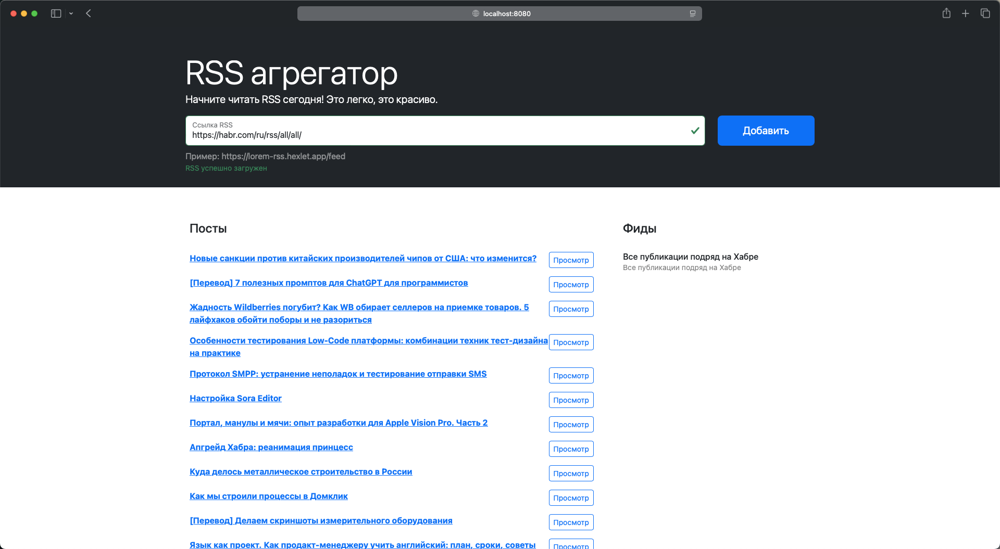

# RSS Aggregator

[](https://github.com/pavlovkeith/frontend-project-11/actions)

[](https://github.com/pavlovkeith/frontend-project-11/actions/workflows/lint-check.yml)

[](https://codeclimate.com/github/pavlovkeith/frontend-project-11/maintainability)

## Описание проекта

**"Rss-aggregator"**
Удобный сервис для сбора RSS-каналов, который позволяет читать контент из разных источников в одном месте. Вы можете добавлять любое количество RSS-каналов, например, с новостных порталов и блогов. Все материалы объединяются в общую ленту, которая автоматически обновляется.

### Технический стек

- **Webpack** — для сборки проекта.
- **Bootstrap** — для стилизации и компонентации интерфейса.
- **i18next** — для локализации приложения.
- **ESLint** — для проверки стиля кода.
- **Jest** — для модульного тестирования.
- **GitHub Actions** — для CI/CD.
- **CodeClimate** — для анализа кода.


## RSS Aggregator Скриншот




## Установка

1. Склонируйте репозиторий:

```sh
git clone https://github.com/pavlovkeith/frontend-project-11.git
```

2. Перейдите в директорию проекта:
```sh
cd frontend-project-11
```

3. Установите зависимости:
```sh
npm install
```

4. Запустите проект:
```sh
npm start
```

5. Откройте в браузере:
```sh
http://localhost:8080
```

## Запуск через Makefile

1. Установка зависимостей:
```sh
make install
```

2. Линтинг кода:
```sh
make lint
```

3. Запуск в режиме разработки:
```sh
make develop
```

4. Сборка проекта:
```sh
make build
```

## Проект также доступен по следующей ссылке:

[RSS Aggregator на Vercel](https://frontend-project-11-pavlovkeith.vercel.app/) - **Посетите развернутую версию проекта на Vercel**
